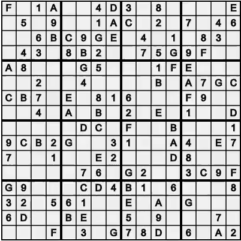

# Sudoku
 
This project aims to solve Sudoku puzzles using a variety of algorithms such as Breadth and Depth First Search, Algorithm X, DLX, as well as their greedy variants.

Link to the app: https://immodal.github.io/sudoku/

  

Figure 1: Solving a 16x16 Sudoku puzzle

